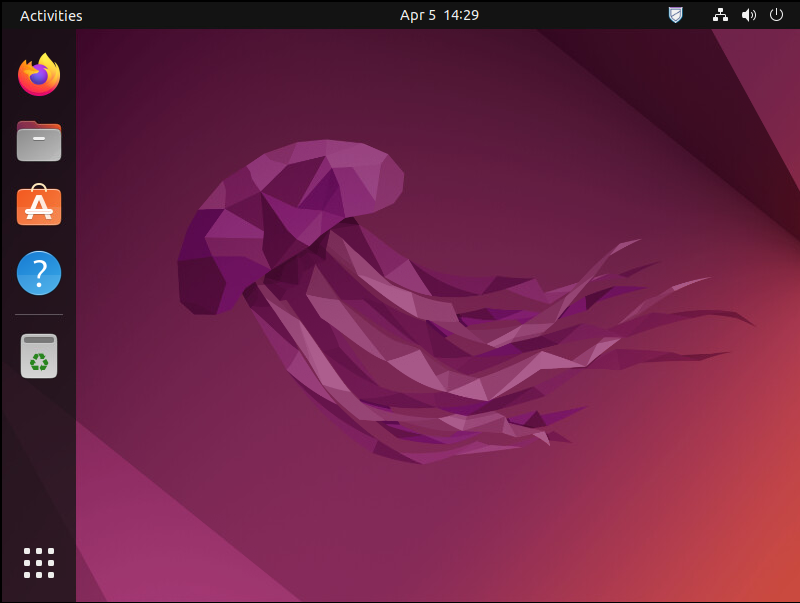
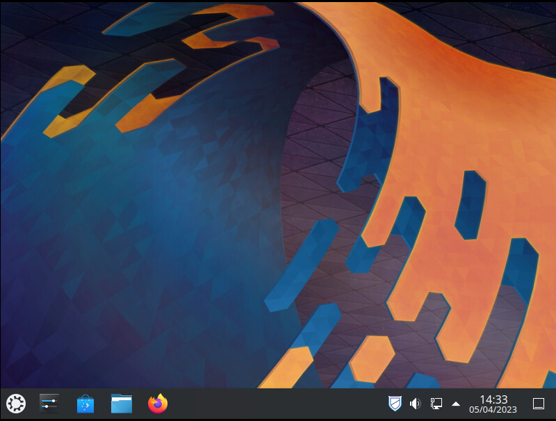
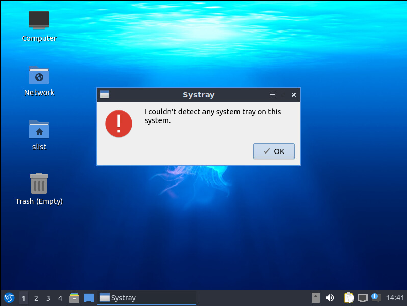
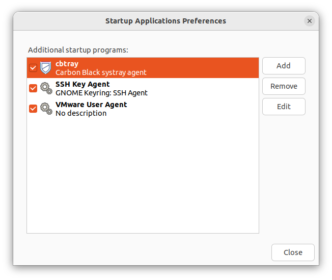
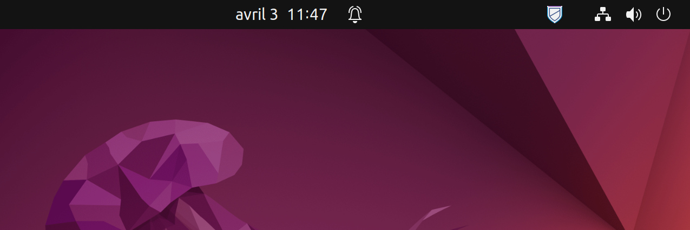
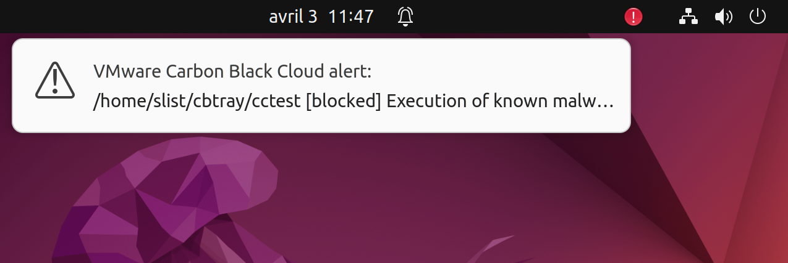
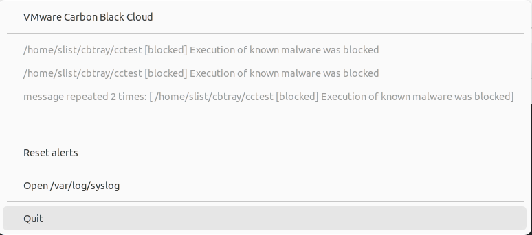

# Carbon Black Cloud systray for Linux

## What can it do? 

* On Ubuntu, cbtray monitors /var/log/syslog to find Carbon Black events
* On RedHat/CentOS, cbtray monitors /var/log/messages to find Carbon Black events
* Show a message when a new log is found in syslog or messages
* Display all Carbon Black messages in the systray
* Reset cbtray icon color and cbtray logs

## Prerequisites

* cbtray has been tested on Ubuntu 20.04, 22.04 and CentOS 7.
* cbtray needs a graphical user interface to run, it is working well with Gnome and KDE (Lubuntu/LXQt is not supported).

## How to build on Linux CentOS 7

### Install required packages and source code
``` sh
sudo yum install qt5-qtbase qt5-qtbase-devel vim-X11 gcc-c++ qt5-linguist git
git clone https://github.com/slist/cbtray.git
```

### Build
``` sh
cd cbtray
qmake-qt5
make
``` 

### Install

``` sh
sudo cp cbtray /usr/local/bin/
mkdir -p ~/.config/autostart
cat <<EOF > ~/.config/autostart/cbtray.desktop 
[Desktop Entry]
Type=Application
Name=cbtray
Exec=/usr/local/bin/cbtray
Comment=Carbon Black systray agent
EOF
``` 

### Change permissions of /var/log/messages

Modify rsyslog.conf
``` sh
 sudo vi /etc/rsyslog.conf
``` 

Modify the rule for /var/log/messages, it should look like this:
```
...
$umask 0022                 ### Add this to reset the umask#
$FileCreateMode 0644        ### Modify this value if you need to set permissions other than 644#
*.info;mail.none;authpriv.none;cron.none /var/log/messages
$umask 0077                 ### Add this to set umask back to default, otherwise all files managed by rsyslogd (/eg /var/log/secure) will be created as world readable (644)
...
```

Restart rsyslog

``` sh
sudo systemctl stop rsyslog
sudo chmod 644 /var/log/messages
sudo systemctl start rsyslog
``` 

Check /var/log/messages permissions, they should look like this (with 3 'r'):
``` sh
[slist@centos7 ~]$ ls -l /var/log/messages
-rw-r--r--. 1 root root 325514 Apr  6 15:20 /var/log/messages
``` 
Logout / Login in your desktop environment.

***
***
## How to build on Linux Ubuntu 20.04 LTS and 22.04 LTS

### Install required packages and source code
``` sh
sudo apt install -y qtcreator qtbase5-dev qt5-qmake imagemagick g++ build-essential git
git clone https://github.com/slist/cbtray.git
```

### Build
``` sh
cd cbtray
qmake
make
``` 

### Install

``` sh
sudo cp cbtray /usr/local/bin/
sudo convert images/cbtray.png -resize 24x24 /usr/share/icons/hicolor/24x24/apps/cbtray.png
sudo chmod +r /usr/share/icons/hicolor/24x24/apps/cbtray.png
mkdir -p ~/.config/autostart
cat <<EOF > ~/.config/autostart/cbtray.desktop 
[Desktop Entry]
Type=Application
Name=cbtray
Exec=/usr/local/bin/cbtray
Icon=cbtray
Comment=Carbon Black systray agent
EOF
``` 
Logout / Login in your desktop environment.

***
***
## Test

You can test cbtray with cctest (Carbon Black EICAR file for Linux):
``` sh
wget https://github.com/slist/LinuxMalware/raw/main/cctest
chmod +x cctest
./cctest
./cctest
```

You should see something like:

``` sh
[slist@centos7 ~]$ ./cctest
Carbon Black© test, execution allowed
[slist@centos7 ~]$ ./cctest
-bash: ./cctest: Operation not permitted
```

The first time, cctest is killed by Carbon Black, but has the time to execute because it's very/too fast, the second attempt cctest can not start.

***
## Uninstall

You can remove cbtray at any time with:
``` sh
rm ~/.config/autostart/cbtray.desktop
```

or using Gnome UI
``` sh
gnome-session-properties 
```

***
## Resources

* Developer Network website: https://developer.carbonblack.com - contains reference documentation, video tutorials, and how-to guides on how to integrate with Carbon Black products
* CbAPI Python module: https://cbapi.readthedocs.io - our Python module that makes interfacing with the Carbon Black APIs easy. Check it out if you're using Python to interface with Cb products.
* CbAPI Python module source code: https://github.com/carbonblack/cbapi-python - the source code to the CbAPI Python module, including example scripts

## Support

If you have questions, don't hesitate to contact me at slist@vmware.com

## License

Use of this software is governed by the license found in LICENSE.md.

## Screenshots

Ubuntu:


Kubuntu:


Lubuntu (not supported):


gnome-session-properties (to enable/disable cbtray at Gnome startup)


cbtray:


Malware detected:


Message:

